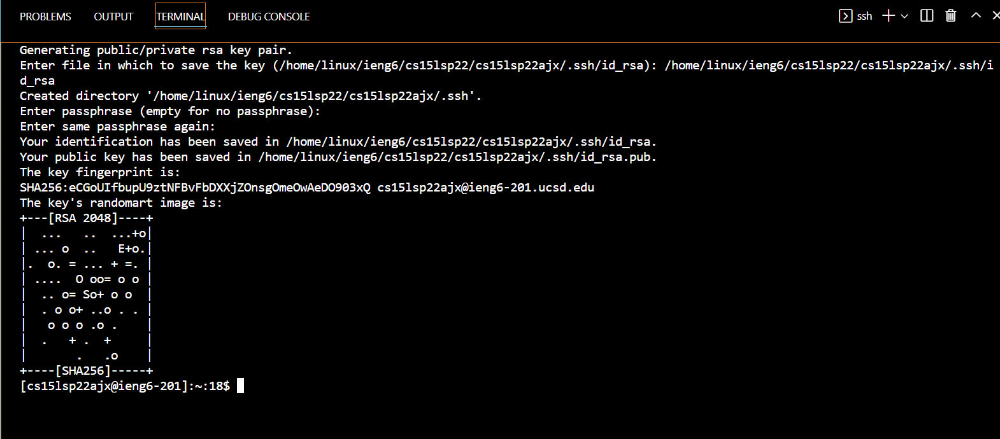

# Remote Access Tutorial
How to login to course-specific account on **ieng6**  and run commands?

---

## Step 1: Installing VScode

- Go to https://code.visualstudio.com/ website to download VScode
- Install the version that match with the computer operating system (for me is Windows)

- When the VScode is successfully installed, the opening page would be like the page shown above
 
 

## Step 2: Remotely Connecting

- For Windows, install [openSSH](https://docs.microsoft.com/en-us/windows-server/administration/openssh/openssh_install_firstuse) following the instructions

- Look up CSE15L course-specific account through this website:
https://sdacs.ucsd.edu/~icc/index.php
 
 

 
 

- Open a terminal in VSCode and type in **ssh** followed by the account
- Then enter the password (the password will not be shown as you type)
- When logged in, the terminal should looks like the above
- *If you didn't connect to the server before, a message that ask "Are you sure you want to continue connecting may be shown. Press yes to continue and enter the password*
 
 

## Step 3: Trying Some Commands
- Try running some commands, like `cd`, `cd ~`, `ls -lat`, `ls -a`, `pwd`, `mkdir`, `cp`  

- I run the command `cp /home/linux/ieng6/cs15lsp22/public/hello.txt ~/`, and the output of permission denied is displayed
 
 
- The command `cd` will display no change because it stay at the current directory 
 
- The command `ls -a` display all the current files and directories, including the files with "." in their names
 
 

## Step 4: Moving Files with **scp**

- I created the java file WhereAmI.java
- `javac` and `java` are run to make sure the file is compiled currently and showing the output
- The command `scp WhereAmI.java cs15lsp22ajx@ieng6.ucsd.edu:~/` (is my username) is runned to copy the WhereAmI.java file to the remote computer  
 

- Log in to the **ieng6** server and use `ls`, the file **WhereAmI.java** is shown in home directory  
 
- The file is compiled using `javac` and `java` command, the output is shown (displaying *Linux* and my username because the current directory, server, username and operating system are different when logged in to remote server)
- The above picture show that the file is successfully copied to the remote computer
 
 

## Step 5: Setting an SSH Key

- Generate SSH keys so no password is needed when logging in ieng server

**On client server or my computer**
- Enter the command `ssh-keygen` 
- Enter the file `/home/linux/ieng6/cs15lsp22ajx/.ssh/id_rsa` (different for each person, the format is like `/Users/<user-name>/.ssh/id_rsa` in the parentheses)
- Do not create passphrase for the key (*just press enter*)
- The above output would be shown  
 

**On the remote ieng server**
- Log in to the server using SSH
- Type the command `mkdir .ssh`
- Logout using `exit`

**Back on my computer**  
 

- Try login in through SSH again
- Password is no longer needed
- No password is needed to `ssh` or `scp` from client to server
 
 

## Step 6: Optimizing Remote Running

*To speed up the process of copying the file to remote server and running the file, some method or shortcut can be used*

(Examples shown in the above picture) 
 

1. I use semicolon to separate multiple commands on the same line and run them at the same time 
2. I put the `ls` command in quotes (" ") after the `ssh` command
    - It login to the remote server, run the command, and logout
    - The command is run directly on the server
    - For example, in the above picture, `ls` is run and output is shown
    - *Notice the server is still client after running*
3. I can use the up-arrow on keyboard to run previous commands that were used
4. I copied and pasted my username so I don't need to type it, which speed up the process

**The above methods can be used in combination to speed up the process of editing the file locally, copying the file to the remote server, and running the file.**
(Could be used to speed up other processes as well)
