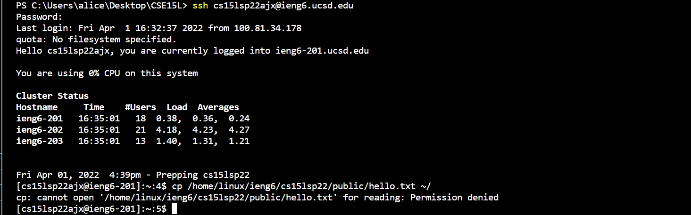

# Remote Access Tutorial
How to log onto course-specific account on **ieng6**?

---

## Step 1: Installing VScode

- Go to https://code.visualstudio.com/ website to download VScode
- Install the version that match with your computer operating system

- When the VScode is successfully installed, the first page shown when VScode is open would like be like this

## Step 2: Remotely Connecting

- If the computer operating system is Windows, install [openSSH](https://docs.microsoft.com/en-us/windows-server/administration/openssh/openssh_install_firstuse) through the link

- Look up CSE15L course-specific account through this website:
https://sdacs.ucsd.edu/~icc/index.php

- Open up a terminal in VSCode and type in **ssh** followed by the account
- Then enter the password (the password will not be shown as you type)
- Then when you log in, the terminal should looks like the above
- *If you didn't connect to the server before, a message that ask "Are you sure you want to continue connecting may be shown. Press yes to continue and enter the password*

## Step 3: Trying Some Commands
- Try running some commands, like `cd`, `cd ~`, `ls -lat`, `ls -a`, `pwd`, `mkdir`, `cp`  

- For example, as shown above, the command `cp /home/linux/ieng6/cs15lsp22/public/hello.txt ~/`, and the output of permission denied is displayed
 
 
- The command `cd` will display no change, it stay at the current directory 
 
- The command `ls -a` display all the current files and directories.
- files with names containing "." in the prefix are also shown

## Step 4: Moving Files with **scp**

- As shown above, the java file WhereAmI.java is created
- `javac` and `java` are run to make sure the file is compiled currently and showing the output
- then the command `scp WhereAmI.java cs15lsp22zz@ieng6.ucsd.edu:~/` (with my username) is runned to copy the file to the remote computer from the directory of this WhereAmI.java file  
 

- Log in to the **ieng6** server and use `ls`, the file **WhereAmI.java** should be shown in home directory  
 
- If the file is compiled using `javac` and `java` commad, the output should also be shown (different output since in different directory, under different username and operating system)
- The above picture show that the file is successfully copied to the remote computer

## Step 5: Setting an SSH Key

- Generate SSH keys so no password is needed when logging in ieng server

**On the client server or own server**
- Enter the command `ssh-keygen` 
- Enter the file `(/Users/<user-name>/.ssh/id_rsa): /Users/<user-name>/.ssh/id_rsa`
- Do not create passphrase for the key (*just press enter*)
- The above output would be shown  
 

**On the remote ieng server**
- Log in to the server using SSH
- Type the command `mkdir .ssh`
- Logout using `exit`

**Back on client computer**  
 

- Try login in through SSH again
- Password is no longer needed
- No password is needed to `ssh` or `scp` from client to server

## Step 6: Optimizing Remote Running
