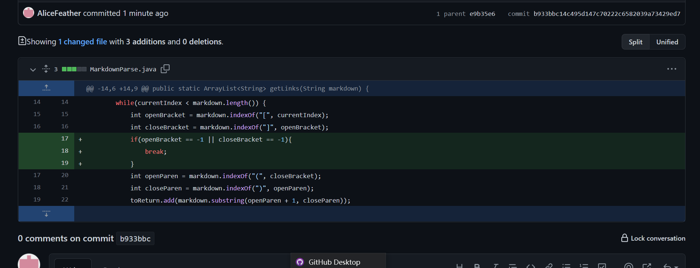
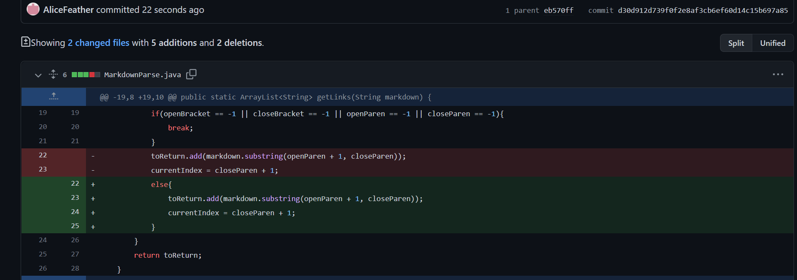

# Lab Report 2 - Debugging
---
<br/>

## Code Change One:
---


[*Failure-Inducing Input Link*](https://github.com/AliceFeather/markdown-parser/blob/main/test-file.md)
- Have a empty or extra line at the end of file

**Symptoms Shown in Terminal**
```
Exception in thread "main" java.lang.OutOfMemoryError: Java heap space      
        at java.base/java.util.Arrays.copyOfRange(Arrays.java:3822)
        at java.base/java.lang.StringLatin1.newString(StringLatin1.java:769)
        at java.base/java.lang.String.substring(String.java:2709)
        at MarkdownParse.getLinks(MarkdownParse.java:22)
        at MarkdownParse.main(MarkdownParse.java:32)
```
<br/>
The bug of "Out of Memory Error" show the symptoms of lagging and the output of *Java heap space*. The input of having one extra empty line in the file after the links cause the while loop to go on forever. Because the `indexOf()` function will keep looking for open brackets and close brackets. If it doesn't find it, the function will returns -1, which will cause the loop to keep going on without breaking. It will keep looping until it find one.

<br/>

## Code Change Two:
---


[*Failure-Inducing Input Link*](https://github.com/AliceFeather/markdown-parser/blob/main/new-test-file.md)
- Have a [] at the end of the file

**Symptoms Shown in Terminal**
```
Exception in thread "main" java.lang.OutOfMemoryError: Java heap space
        at java.base/java.util.Arrays.copyOfRange(Arrays.java:3822)
        at java.base/java.lang.StringLatin1.newString(StringLatin1.java:769)
        at java.base/java.lang.String.substring(String.java:2709)
        at MarkdownParse.getLinks(MarkdownParse.java:19)
        at MarkdownParse.main(MarkdownParse.java:30)
```
<br/>
The bug of "Out of Memory Error" still came up for the new test case. It still has the symptoms of lagging and the output of *Java heap space*. The while loop still goes on forever when there's a empty [] at the end of the test file. The `indexOf` function will loop for open and close parentheses after brackets are found. But there's no parentheses after [], so the function returns -1, which cause the loop to keep running without breaking and keep looking for the parentheses.

<br/>

## Code Change Three:
---


[*Failure-Inducing Input Link*](https://github.com/AliceFeather/markdown-parser/blob/main/lab_part5.md)
- Have no link in the file

**Symptoms Shown in Terminal**
```
Exception in thread "main" java.lang.StringIndexOutOfBoundsException: begin 0, end -1, length 43
at java.base/java.lang.String.checkBoundsBeginEnd(String.java:4601)
at java.base/java.lang.String.substring(String.java:2704)
at MarkdownParse.getLinks(MarkdownParse.java:22)
at MarkdownParse.main(MarkdownParse.java:33)
```
<br/>

The "OutOfBoundsException" error was related to the "Out of Memory" error shown before. In previous steps, an if statement was added to check if the return value of the four `indexOf` functions are -1, but an else statement was not added. The input in this case is that there's no link in the test file. When running the file, a substring need to be created. However, because one of the variables that was used to set the index values to obtain the substring is -1, a "OutOfBoundsException" error appeared. And the program cannot be executed correctly. The correct outcome suppose to be an empty list. The variables store the outcome of the `indexOf` function, which is why they may be -1 when there's no link in the file. So an else statement need to be added to make sure that a substring is created only when all the variables are not -1.


