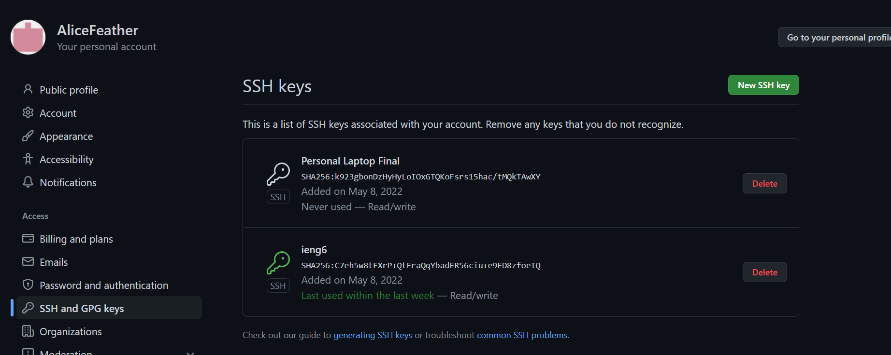
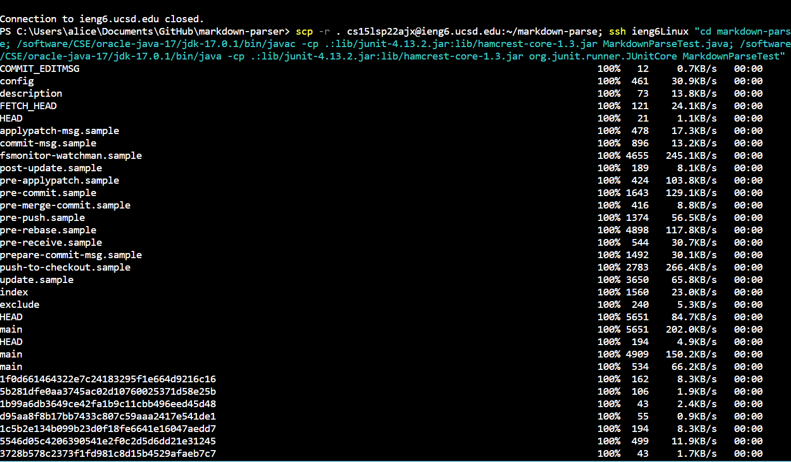

# Lab Report 3
---
 

## Streamlining ssh Configuration:
---
1\. **ssh/config file**

 

- I created the config file in .ssh folder and I edit the file using VScode.
 

2\. **Login using alias**

- I login the to my ieng6 account just using the alias that I chose, which is *ieng6Linux*. And I can login without inputting password.
 

3\. **Copy file to my account**

- Copied the file **LabReportDemo.java** to the ieng6 account server using `scp` with the alias

 

## Setup Github Access from ieng6
---
1\. **Public Key**

- The public key, which end in .pub, are stored in the local computer

- The public key is also stored in Github, which is named **Personal Laptop Final**
- The other public key is the key for ieng6 machines

 

2\. **Private Key**

- The private key does not end with .pub. And they are stored in local computer in ssh folder as shown above

- The private key for ieng6 machine is stored in .ssh for ieng6 acount as shown above

 

3\. **Git commit and push**

- Commit and push was done through git commands
while logging in to ieng6 account

- [Link for the resulting commit](https://github.com/AliceFeather/markdown-parser/commit/40683d03de615b1d9f2fdc25dde3b5159d783c22
)

 

## Copy whole directories with `scp -r`
---

1\. **Copying whole directory**

- The command `scp -r . cs15lsp22ajx@ieng6.ucsd.edu:~/markdown-parse` was runned
- And the whole markdown-parse directory was copied to ieng6 account

 

2\. **Logging in to ieng6 to check and run tests**

- After logging in ieng6, using the command `ls markdown-parse` to check if markdown-parse directory is successfully copied to the account server.
- The files in the directory are copied over as well
 

- The above picture show the compiling and running of the tests in MarkdownParseTest.java and the outputs

 

3\. **Combining commands to run at once**

- As you can see in the above pictures, the command: `scp -r . cs15lsp22ajx@ieng6.ucsd.edu:~/markdown-parse; ssh ieng6Linux "cd markdown-parse; /software/CSE/oracle-java-17/jdk-17.0.1/bin/javac -cp .:lib/junit-4.13.2.jar:lib/hamcrest-core-1.3.jar MarkdownParseTest.java; /software/CSE/oracle-java-17/jdk-17.0.1/bin/java -cp .:lib/junit-4.13.2.jar:lib/hamcrest-core-1.3.jar org.junit.runner.JUnitCore MarkdownParseTest"` is runned
- Copying directory to ieng6 account server, logging in ieng6, and compiling and running tests were done at the same time by combining the commands together in one line using **;** and **" "**

