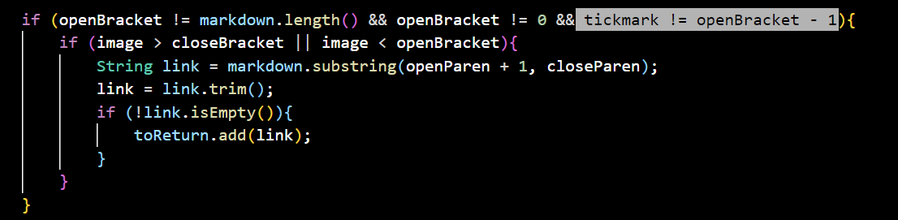
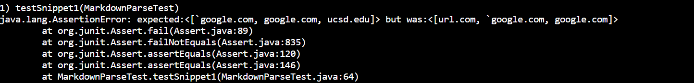
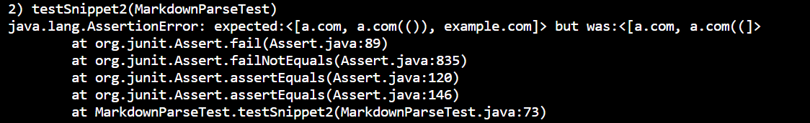
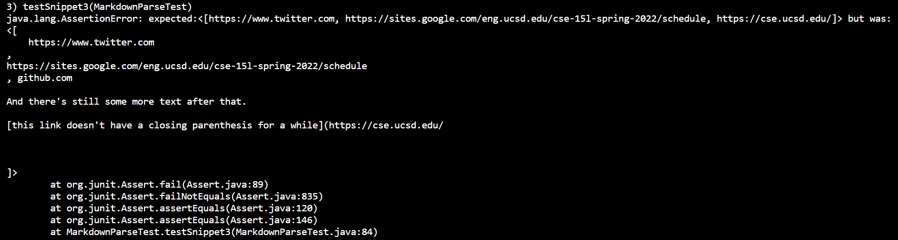

# Lab Report 4
---
 

## Links to Repositories
---

## Expected Outcomes for Three Snippets
---
1. **Snippet 1**
    - ["`google.com", "google.com", "ucsd.edu"]
 
2. **Snippet 2**
    - ["a.com", "a.com(())", "example.com"]
 
3. **Snippet 3**
    - ["https://www.twitter.com", "https://sites.google.com/eng.ucsd.edu/cse-15l-spring-2022/schedule", "https://cse.ucsd.edu/"]

## Test Code in MarkdownParseTest.java
---

1. **Snippet 1**

 

2. **Snippet 2**

 

3. **Snippet 3**

 

## My Own Implementation
---

1. **Snippet 1 Test result - Fails**
 
The test passed.
The test passes because I add a if statement checking if there's backtick just before the openBracket. If there is, the loop breaks so this link won't be counted.

2. **Snippet 2 Test result - Fails**
 

3. **Snippet 3 Test result - Fails**
 

 

## Implementation Reviewed in Week 7
---

1. **Snippet 1 Test result - Fails**
 

2. **Snippet 2 Test result - Fails**
 

3. **Snippet 3 Test result - Fails**
 

 

## Possible Code Change to Make Tests Pass

**Snippet 1** \
Yes, by checking if the backticks are between the parentheses can make the tests pass. If the indexes of the backticks are between the indexes of open and close parentheses (not brackets, backticks in brackets don't count as part of the link), then the loop continues. For my own implementation, it passes because I add a if statement to check if the backtick is in front of the openBracket, if it is, then the next link won't be counted.

 

**Snippet 2** \
No, it to be a more involved change because nested () and [] are hard to determine. A method that just find the outside () was needed, so the other () which is inside these outside () would be counted as apart of the links. And the method may not be completed using only 10 lines.

 

**Snippet 3** \
Yes, by checking if there's newline between the () and [] can make the tests pass. Using a if statement to determine if the newline index is between () or [], if it is, then the loop continues, else it breaks. This can ensure the link will still be counted if there's new lines between the () and [].
