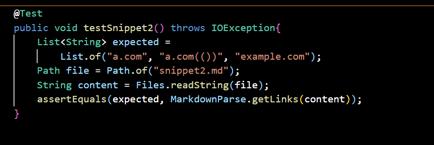

# Lab Report 4
---
 

## Links to Repositories
---

## Expected Outcomes for Three Snippets
---
1. **Snippet 1**
    - ["`google.com", "google.com", "ucsd.edu"]
 
2. **Snippet 2**
    - ["a.com", "a.com(())", "example.com"]
 
3. **Snippet 3**
    - ["https://www.twitter.com", "https://sites.google.com/eng.ucsd.edu/cse-15l-spring-2022/schedule", "https://cse.ucsd.edu/"]

## Test Code in MarkdownParseTest.java
---

1. **Snippet 1**

 

2. **Snippet 2**

 

3. **Snippet 3**

 

## My Own Implementation
---

1. **Snippet 1 Test result - Fails**
 

2. **Snippet 2 Test result - Fails**
 

3. **Snippet 3 Test result - Fails**
 

 

## Implementation Reviewed in Week 7
---