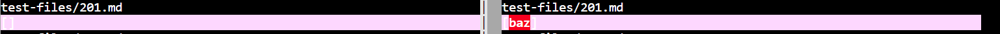
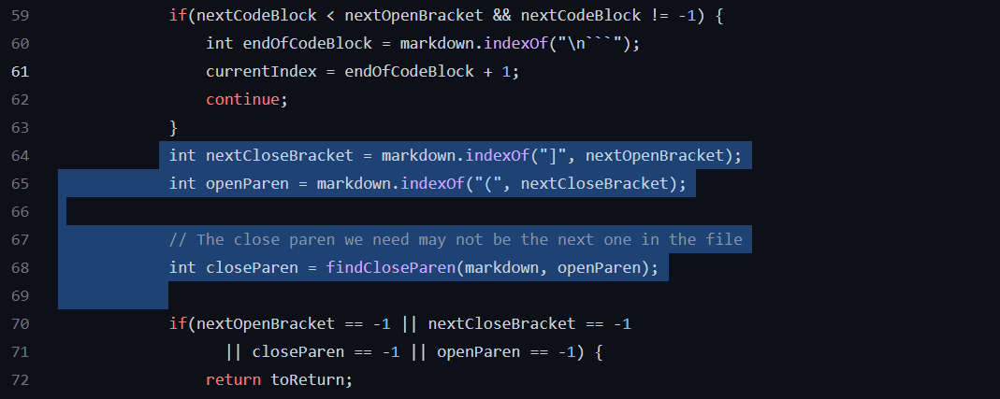
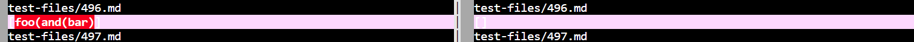
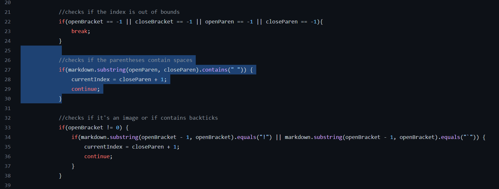

# Lab Report 5
---
<br/>

## How did I found tests with different result?
---
I found the tests with different result by using `vim` with the command:
```
vimdiff my-markdown-parser/results.txt cse15lsp22-markdown-parser/results.txt
```
Adding a print statement that print out the test file name in the bash file can allow me to know which file to check. Then save the result of running bash for both implementations to two separate text file. And compare them using `vimdiff`. Then manually look up the test file in the repository and see what should be the expected output. And determine which implementation is correct for this test.

<br/>

## First Test
---
**Link for test-file 201**: https://github.com/nidhidhamnani/markdown-parser/blob/main/test-files/201.md

- Our group's implementation is correct. The provided implementation is incorrect.

- Actual Outputs (Right is ours, Left is provided):



- Expected Output:
[]

- Bug in provided implementation:



The problem in the code is that it doesn't check to see if there's anything between the closed bracket and the open parentheses to see if the two are closely next together, not with anything in between. The output should be empty because there's a semicolon in front of the parentheses that contains "baz". So "baz" should not be counted as a link. By adding a if statement to check if the character at the index between the open parentheses is the bracket
could fix the error. Like if the character is a semicolon, it won't add "baz" as a link in the result.


<br/>

## Second Test
---
**Link for test-file 496**: https://github.com/nidhidhamnani/markdown-parser/blob/main/test-files/496.md

- The provided implementation is correct. Our group's implementation is incorrect

- Actual Output (Right is ours, Left is provided):



- Expected Output:
[]

- Bug in our implementation:



The problem in the code is that it didn't check if there's parentheses in the open and end parentheses after the close bracket. So for our implementation, the "foo(and(bar)" is considered a link, but it is not according to preview. To fix it, a if statement can be added to check if the string between the open and close parentheses contains "(" or ")". If it does, then the link in between should not be added to the result. A for loop could also be used to check each characters between the open and close parentheses after the brackets. 

